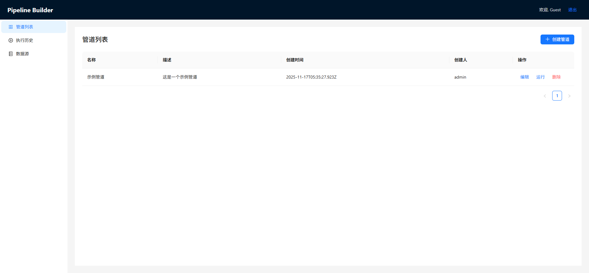
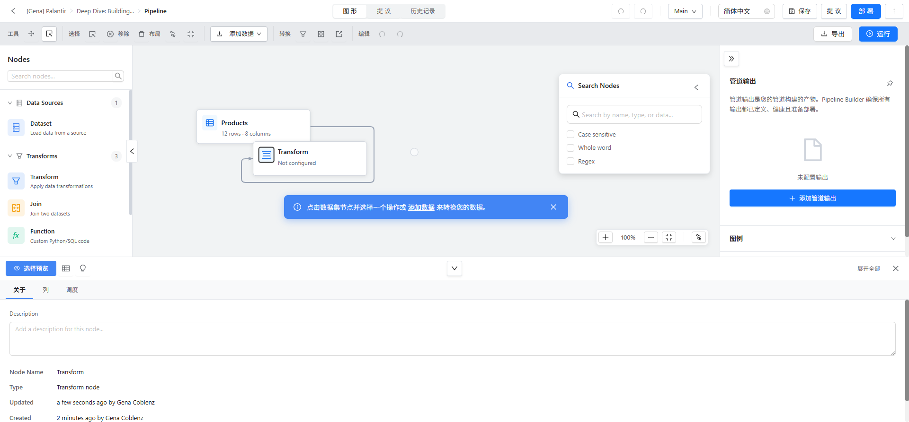
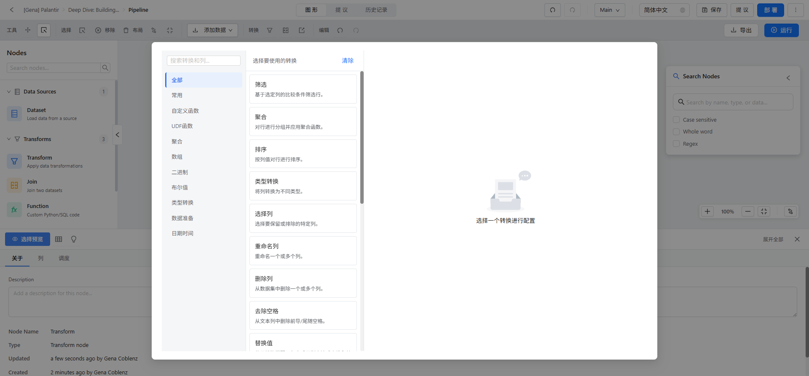
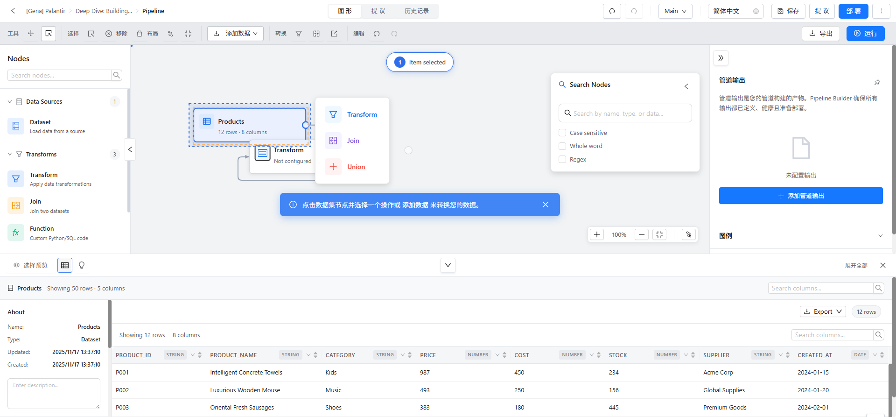
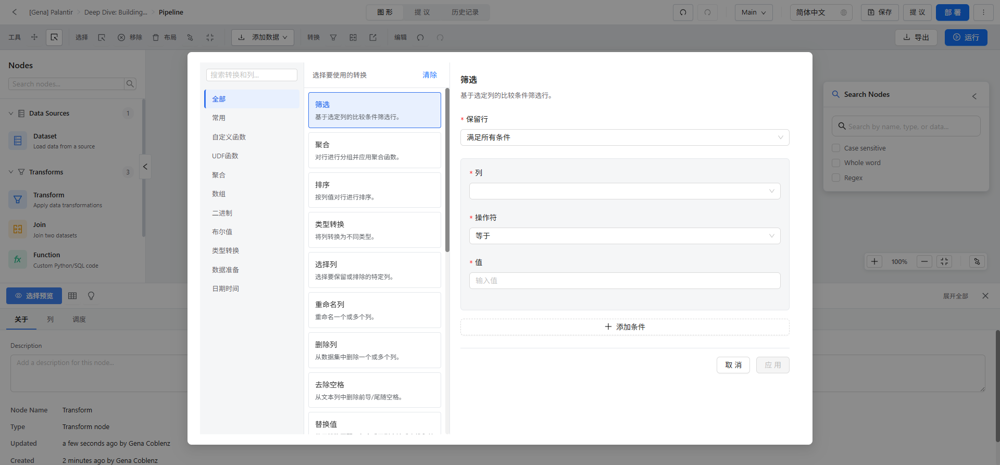

# Pipeline Builder - 产品需求文档 (PRD)

> **文档版本**: v1.0
> **创建日期**: 2025-11-17
> **产品名称**: Pipeline Builder - 可视化数据管道构建平台
> **对标产品**: Palantir Foundry Pipeline Builder
> **文档作者**: 产品团队
> **更新记录**: 初始版本

---

## 📋 目录

1. [产品概述](#1-产品概述)
2. [市场分析](#2-市场分析)
3. [用户画像](#3-用户画像)
4. [核心功能需求](#4-核心功能需求)
5. [功能详细说明](#5-功能详细说明)
6. [技术架构](#6-技术架构)
7. [交互设计](#7-交互设计)
8. [非功能性需求](#8-非功能性需求)
9. [项目里程碑](#9-项目里程碑)
10. [附录](#10-附录)

---

## 1. 产品概述

### 1.1 产品定位

**Pipeline Builder** 是一款**企业级可视化数据管道构建平台**，旨在为数据工程师、数据分析师和业务用户提供一个**低代码、高效率**的数据处理工具。通过直观的拖拽式界面，用户可以快速构建复杂的数据处理流程，无需编写大量代码。

**核心价值主张**:
- 🎯 **降低技术门槛** - 让非技术人员也能处理数据
- ⚡ **提升开发效率** - 可视化操作比传统编码快10倍
- 🔄 **保证数据质量** - 内置50+种数据转换和验证
- 📊 **实时数据预览** - 所见即所得的数据处理体验
- 🌍 **企业级标准** - 对标Palantir Foundry的专业水准

### 1.2 产品目标

**短期目标** (3-6个月):
- ✅ 完成核心功能开发（已完成93%）
- ✅ 实现50+种数据转换操作
- ✅ 支持CSV/Excel数据导入导出
- ⏳ 后端API集成和真实数据处理
- ⏳ 用户测试和反馈收集

**中期目标** (6-12个月):
- 🎯 支持Python/SQL自定义转换
- 🎯 实现实时协作编辑功能
- 🎯 集成更多数据源（MySQL、PostgreSQL、MongoDB等）
- 🎯 添加数据质量监控和告警
- 🎯 支持Pipeline版本控制和回滚

**长期目标** (12-24个月):
- 🚀 AI辅助的智能推荐系统
- 🚀 企业级调度和编排系统
- 🚀 数据血缘追踪和影响分析
- 🚀 多租户和权限管理体系
- 🚀 SaaS化部署和云原生支持

### 1.3 产品截图

**主界面 - Pipeline列表**



*图1: Pipeline管理界面，展示所有已创建的数据管道*

---

**可视化编辑器**



*图2: 核心编辑界面，采用Palantir风格的浅色主题设计*

---

**Transform配置面板**



*图3: 50+种数据转换操作，支持搜索和分类浏览*

---

**数据预览**



*图4: 实时数据预览，支持列统计、搜索和导出*

---

## 2. 市场分析

### 2.1 市场机会

**数据处理市场规模**:
- 全球数据处理工具市场规模: **$50B+** (2025年)
- 年复合增长率(CAGR): **28%**
- 企业数字化转型推动需求持续增长

**痛点分析**:

| 痛点 | 影响人群 | 严重程度 | 解决方案 |
|------|---------|---------|---------|
| **技术门槛高** | 业务分析师、产品经理 | ⭐⭐⭐⭐⭐ | 可视化拖拽界面 |
| **开发效率低** | 数据工程师 | ⭐⭐⭐⭐ | 50+预置转换操作 |
| **调试困难** | 所有用户 | ⭐⭐⭐⭐ | 实时数据预览 |
| **文档缺失** | 团队协作 | ⭐⭐⭐ | 自动生成数据血缘 |
| **成本高昂** | 企业决策者 | ⭐⭐⭐⭐⭐ | 开源免费方案 |

### 2.2 竞品分析

| 产品 | 优势 | 劣势 | 定价 |
|------|------|------|------|
| **Palantir Foundry** | 功能强大、企业级 | 价格昂贵($100K+/年)、封闭 | 💰💰💰💰💰 |
| **Apache Airflow** | 开源、灵活 | 需要编程、学习曲线陡峭 | 免费 |
| **Tableau Prep** | 易用、可视化好 | 功能有限、不支持代码 | 💰💰💰 |
| **Talend** | 功能全面 | 界面复杂、性能一般 | 💰💰💰💰 |
| **Pipeline Builder** | **开源、易用、专业** | 新产品、社区小 | **免费** |

**差异化优势**:
1. ✅ **1:1对标Palantir** - 但完全免费开源
2. ✅ **现代化技术栈** - Vue 3 + TypeScript
3. ✅ **50+转换操作** - 覆盖90%数据处理场景
4. ✅ **实时预览** - 所见即所得
5. ✅ **国际化支持** - 中英文双语

---

## 3. 用户画像

### 3.1 目标用户群体

#### 核心用户 (Primary Users)

**1. 数据分析师**
- **年龄**: 25-40岁
- **技能**: SQL熟练，Python基础，Excel高级用户
- **痛点**:
  - 需要频繁清洗和转换数据
  - Excel处理大数据集性能差
  - 依赖IT部门编写ETL脚本
- **使用场景**:
  - 销售数据分析
  - 用户行为分析
  - 运营报表生成
- **期望**: 自主完成数据处理，无需等待IT支持

**2. 数据工程师**
- **年龄**: 28-45岁
- **技能**: Python/Java精通，数据库专家，大数据技术
- **痛点**:
  - 重复编写相似的ETL代码
  - 维护复杂的数据处理脚本
  - 调试困难，错误定位耗时
- **使用场景**:
  - 构建企业级数据管道
  - 数据仓库ETL
  - 实时数据处理流
- **期望**: 提升开发效率，减少重复劳动

**3. 业务分析师/产品经理**
- **年龄**: 25-38岁
- **技能**: SQL基础，Excel熟练，数据敏感
- **痛点**:
  - 完全依赖技术团队获取数据
  - 需求变更响应慢
  - 无法自主探索数据
- **使用场景**:
  - 产品数据分析
  - 用户画像构建
  - A/B测试数据处理
- **期望**: 自助获取和处理数据，快速验证假设

#### 次要用户 (Secondary Users)

**4. IT管理员**
- **职责**: 系统部署、权限管理、监控维护
- **需求**: 易部署、易维护、安全可控

**5. 企业决策者**
- **关注**: ROI、团队效率提升、成本控制
- **需求**: 降低数据处理成本、提升团队产出

### 3.2 用户使用场景

**场景1: 销售数据周报生成** (数据分析师)
```
1. 从数据库导入销售数据
2. 筛选最近7天的记录
3. 按产品类别分组聚合
4. 计算同比环比增长
5. 导出为Excel报表
```

**场景2: 用户行为数据清洗** (数据工程师)
```
1. 从多个日志文件导入数据
2. 合并(Join)用户信息表
3. 去除异常值和重复记录
4. 类型转换和格式标准化
5. 输出到数据仓库
```

**场景3: A/B测试数据分析** (产品经理)
```
1. 导入实验组和对照组数据
2. 筛选有效样本
3. 计算关键指标(转化率、留存率)
4. 生成对比报表
5. 分享给团队
```

---

## 4. 核心功能需求

### 4.1 功能优先级

| 优先级 | 功能模块 | 描述 | 完成度 |
|--------|---------|------|--------|
| **P0** | 可视化编辑器 | 拖拽式节点编辑、连线 | ✅ 100% |
| **P0** | 数据转换引擎 | 50+种转换操作 | ✅ 92% |
| **P0** | 数据预览 | 实时预览节点输出 | ✅ 100% |
| **P0** | 导入导出 | CSV/Excel支持 | ✅ 90% |
| **P1** | Pipeline管理 | 创建、保存、加载 | ✅ 95% |
| **P1** | 执行引擎 | 拓扑排序、缓存优化 | ✅ 95% |
| **P1** | Join功能 | 4种Join类型 | ✅ 100% |
| **P2** | 后端集成 | 真实数据库连接 | ⏳ 0% |
| **P2** | 用户系统 | 登录、权限管理 | ⏳ 20% |
| **P3** | 版本控制 | Pipeline版本管理 | ⏳ 0% |
| **P3** | 协作功能 | 多人编辑、评论 | ⏳ 0% |

### 4.2 功能模块划分

```
Pipeline Builder
├── 1. 用户管理模块
│   ├── 用户注册/登录
│   ├── 角色权限管理
│   └── 个人设置
│
├── 2. Pipeline管理模块
│   ├── Pipeline列表
│   ├── 创建/编辑/删除
│   ├── 搜索和过滤
│   └── 分享和协作
│
├── 3. 可视化编辑器
│   ├── 画布操作(拖拽、缩放、平移)
│   ├── 节点管理(添加、删除、连接)
│   ├── 工具栏(快捷操作)
│   ├── 节点面板(节点库)
│   └── 属性面板(节点配置)
│
├── 4. 数据源管理
│   ├── Dataset节点(本地文件)
│   ├── 数据库连接
│   ├── API数据源
│   └── 文件上传
│
├── 5. 数据转换引擎
│   ├── 基础转换(15种)
│   ├── 字符串处理(12种)
│   ├── 数值处理(10种)
│   ├── 日期处理(8种)
│   └── 聚合分组(5种)
│
├── 6. 数据预览
│   ├── 表格视图
│   ├── 列统计信息
│   ├── 数据搜索
│   └── 导出功能
│
├── 7. 执行引擎
│   ├── Pipeline验证
│   ├── 拓扑排序
│   ├── 数据缓存
│   └── 错误处理
│
└── 8. 辅助功能
    ├── 国际化(中英文)
    ├── 快捷键
    ├── 撤销/重做
    └── 帮助文档
```

---

## 5. 功能详细说明

### 5.1 可视化编辑器

#### 5.1.1 画布操作

**基础操作**:
- ✅ **拖拽移动** - 鼠标拖拽节点自由移动位置
- ✅ **缩放** - 鼠标滚轮或工具栏按钮缩放画布(10%-400%)
- ✅ **平移** - 按住空格键拖拽画布
- ✅ **框选** - 空白处拖拽框选多个节点
- ✅ **对齐辅助** - 拖拽时显示对齐线(Snapline)

**快捷键**:
```
Ctrl/Cmd + C     复制选中节点
Ctrl/Cmd + V     粘贴节点
Ctrl/Cmd + Z     撤销
Ctrl/Cmd + Y     重做
Delete           删除选中节点
Ctrl/Cmd + A     全选
Esc              取消选择
Ctrl/Cmd + 0     重置缩放
Ctrl/Cmd + S     保存Pipeline
```

#### 5.1.2 节点系统

**节点类型**:

1. **Dataset节点** (数据源)
   - **图标**: 🗄️ 数据库图标
   - **颜色**: 蓝色 (#4285F4)
   - **端口**: 1个输出端口
   - **功能**: 加载原始数据
   - **配置**:
     - 数据源类型(Products, Customers等)
     - Snapshot版本选择

2. **Transform节点** (数据转换)
   - **图标**: 🔧 转换图标
   - **颜色**: 紫色 (#9334E6)
   - **端口**: 1个输入端口 + 1个输出端口
   - **功能**: 应用数据转换操作
   - **配置**:
     - 转换类型选择(50+种)
     - 转换参数配置
     - 支持多Transform链式处理

3. **Join节点** (数据关联)
   - **图标**: 🔗 连接图标
   - **颜色**: 橙色 (#F59E0B)
   - **端口**: 2个输入端口 + 1个输出端口
   - **功能**: 合并两个数据表
   - **配置**:
     - Join类型(Inner/Left/Right/Full)
     - 左表连接键
     - 右表连接键

4. **Output节点** (数据输出)
   - **图标**: 📤 导出图标
   - **颜色**: 绿色 (#34A853)
   - **端口**: 1个输入端口
   - **功能**: 标记输出端点
   - **配置**:
     - 输出格式(CSV/Excel/JSON)
     - 保存路径

#### 5.1.3 连接系统

**连接规则**:
- ✅ 只能从输出端口连接到输入端口
- ✅ 不允许循环连接(DAG限制)
- ✅ 支持一对多连接(一个输出连接多个输入)
- ✅ 连接线自动路由(Manhattan或Bezier)

**连接交互**:
1. 鼠标悬停输出端口 → 端口高亮放大
2. 按住鼠标拖拽 → 显示虚线连接线
3. 移动到目标输入端口 → 端口高亮
4. 释放鼠标 → 创建连接
5. 连接验证 → 成功或显示错误提示

**连接操作**:
- ✅ **编辑连接** - 点击连接线中点显示工具按钮
- ✅ **删除连接** - 选中连接线按Delete键
- ✅ **重新连接** - 拖拽连接线端点到新端口

---

### 5.2 数据转换引擎

#### 5.2.1 转换类型总览

**基础操作** (15种):
```
1. Filter (筛选)              - 基于条件过滤行
2. Sort (排序)                - 按列值排序
3. Select Columns (选择列)    - 保留指定列
4. Rename Columns (重命名)    - 修改列名
5. Remove Columns (删除列)    - 移除指定列
6. Add Column (添加列)        - 创建新列
7. Distinct (去重)            - 删除重复行
8. Limit (限制)               - 限制行数
9. Sample (采样)              - 随机采样
10. Fill Null (填充空值)      - 填充缺失值
11. Drop Null (删除空值)      - 删除包含空值的行
12. Group By (分组)           - 分组聚合
13. Pivot (透视)              - 数据透视
14. Unpivot (反透视)          - 还原透视
15. Union (合并)              - 纵向合并表
```

**字符串处理** (12种):
```
1. Trim (去空格)              - 删除前后空格
2. Upper Case (大写)          - 转换为大写
3. Lower Case (小写)          - 转换为小写
4. Title Case (标题大小写)    - 首字母大写
5. Split (拆分)               - 按分隔符拆分
6. Replace (替换)             - 查找替换
7. Concat (连接)              - 合并多列
8. Substring (子串)           - 提取子字符串
9. Length (长度)              - 计算字符串长度
10. Regex Extract (正则提取) - 正则表达式提取
11. Parse JSON                - 解析JSON字符串
12. Parse URL                 - 解析URL
```

**数值处理** (10种):
```
1. Cast (类型转换)            - 转换数据类型
2. Round (四舍五入)           - 数值舍入
3. Ceil (向上取整)            - 向上取整
4. Floor (向下取整)           - 向下取整
5. Abs (绝对值)               - 计算绝对值
6. Add (加法)                 - 数值相加
7. Subtract (减法)            - 数值相减
8. Multiply (乘法)            - 数值相乘
9. Divide (除法)              - 数值相除
10. Modulo (取模)             - 取余数
```

**日期处理** (8种):
```
1. Format Date (格式化日期)   - 日期格式转换
2. Parse Date (解析日期)      - 字符串转日期
3. Extract Year (提取年份)    - 提取年份
4. Extract Month (提取月份)   - 提取月份
5. Extract Day (提取天)       - 提取天
6. Add Days (添加天数)        - 日期加减
7. Date Diff (日期差)         - 计算日期差
8. Current Date (当前日期)    - 获取当前日期
```

**聚合分组** (5种):
```
1. Count (计数)               - 计数聚合
2. Sum (求和)                 - 求和聚合
3. Average (平均值)           - 平均值聚合
4. Min/Max (最小/最大值)      - 极值聚合
5. Group By (分组)            - 分组聚合
```

#### 5.2.2 Transform配置界面



*图5: Filter转换配置界面示例*

**界面组成**:
1. **左侧分类** - 转换类型分类导航
2. **中间列表** - 转换操作列表(可搜索)
3. **右侧配置** - 选中转换的参数配置表单
4. **顶部标签** - 已应用的转换标签(紫色)

**交互流程**:
```
1. 双击Transform节点 → 打开配置面板
2. 左侧选择分类 → 筛选转换类型
3. 点击转换名称 → 右侧显示配置表单
4. 填写转换参数 → 实时验证
5. 点击"应用"按钮 → 添加Transform标签
6. 重复2-5 → 添加多个转换
7. 点击标签×按钮 → 删除转换
8. 关闭面板 → 保存配置
```

#### 5.2.3 Transform标签栏系统

**设计理念**:
- 🎯 **可视化Transform链** - 一眼看清所有应用的转换
- 🔧 **快速管理** - 点击×删除不需要的转换
- 🎨 **Palantir风格** - 紫色圆角标签设计

**实现效果**:
```
┌─────────────────────────────────────────┐
│ Applied Transforms:                     │
│ ┌──────────┐ ┌──────────┐ ┌──────────┐ │
│ │ Filter ×│ │ Sort  ×│ │ Cast   ×│ │
│ └──────────┘ └──────────┘ └──────────┘ │
└─────────────────────────────────────────┘
```

**数据结构**:
```typescript
// 单Transform配置
interface Transform {
  id: string              // 唯一ID
  type: string            // 转换类型(filter/sort/cast...)
  name: string            // 显示名称
  params: Record<string, any>  // 转换参数
  enabled: boolean        // 是否启用
}

// 节点多Transform数组
node.data.transforms = [
  { id: '1', type: 'filter', name: 'Filter', params: {...} },
  { id: '2', type: 'sort', name: 'Sort', params: {...} },
  { id: '3', type: 'cast', name: 'Cast', params: {...} }
]
```

---

### 5.3 数据预览系统

#### 5.3.1 预览触发

**自动预览**:
- ✅ 选中节点 → 自动加载数据
- ✅ 应用Transform → 实时更新预览
- ✅ 切换节点 → 立即切换预览数据

**手动刷新**:
- 点击刷新按钮
- 快捷键 F5

#### 5.3.2 预览功能

**表格展示**:
- ✅ 分页显示(默认50行/页)
- ✅ 虚拟滚动(支持大数据集)
- ✅ 列宽自适应
- ✅ 固定表头

**列操作**:
- ✅ **排序** - 点击列头升序/降序排序
- ✅ **搜索** - 搜索框过滤列
- ✅ **统计** - 显示列数据类型和统计信息
- ✅ **隐藏** - 临时隐藏不需要的列

**列统计信息**:
```
Column: price (Number)
├── Total Rows: 12
├── Non-null: 12 (100%)
├── Null: 0 (0%)
├── Min: 304
├── Max: 987
├── Average: 528.5
└── Unique: 12
```

**导出功能**:
- ✅ CSV导出
- ✅ Excel导出
- ✅ JSON导出
- ✅ 全量或采样导出

---

### 5.4 Join功能

#### 5.4.1 Join类型

**Inner Join** (内连接):
```
只返回两表中键值匹配的行

Left Table:        Right Table:       Result:
id | name          id | score         id | name | score
1  | Alice         1  | 90            1  | Alice | 90
2  | Bob           3  | 85            3  | Carol | 85
3  | Carol
```

**Left Join** (左连接):
```
返回左表所有行，右表匹配的行，不匹配填充null

Left Table:        Right Table:       Result:
id | name          id | score         id | name  | score
1  | Alice         1  | 90            1  | Alice | 90
2  | Bob           3  | 85            2  | Bob   | null
3  | Carol                            3  | Carol | 85
```

**Right Join** (右连接):
```
返回右表所有行，左表匹配的行，不匹配填充null
```

**Full Outer Join** (全外连接):
```
返回两表所有行，不匹配的填充null
```

#### 5.4.2 Join配置

**配置参数**:
1. **Join Type** - 选择连接类型
2. **Left Key** - 左表连接键列名
3. **Right Key** - 右表连接键列名
4. **Key Comparison** - 键值比较方式(等于/大于/小于)

**配置界面**:
```
┌─────────────────────────────────┐
│ Join Configuration              │
├─────────────────────────────────┤
│ Join Type:  [Inner Join ▼]     │
│                                 │
│ Left Table:  Products           │
│ Left Key:    [product_id ▼]    │
│                                 │
│ Right Table: Orders             │
│ Right Key:   [product_id ▼]    │
│                                 │
│ [Cancel]  [Apply]               │
└─────────────────────────────────┘
```

---

### 5.5 Pipeline管理

#### 5.5.1 Pipeline列表

**列表展示**:
- Pipeline名称
- 描述
- 创建时间
- 创建人
- 操作按钮(编辑/运行/删除)

**操作功能**:
- ✅ **创建Pipeline** - 新建空白Pipeline
- ✅ **编辑Pipeline** - 打开可视化编辑器
- ✅ **运行Pipeline** - 执行数据处理
- ✅ **删除Pipeline** - 删除确认后删除
- ✅ **搜索Pipeline** - 按名称搜索
- ⏳ **复制Pipeline** - 复制已有Pipeline
- ⏳ **导入/导出** - JSON格式导入导出

#### 5.5.2 Pipeline保存

**保存方式**:
- ✅ **自动保存** - 每次操作后自动保存到LocalStorage
- ✅ **手动保存** - 点击保存按钮(Ctrl+S)
- ⏳ **云端保存** - 后端API持久化

**保存内容**:
```json
{
  "id": "pipeline-uuid",
  "name": "示例管道",
  "description": "这是一个示例管道",
  "nodes": [
    {
      "id": "node-1",
      "type": "dataset",
      "position": { "x": 100, "y": 100 },
      "data": {
        "dataSource": "products",
        "transforms": []
      }
    }
  ],
  "edges": [
    {
      "id": "edge-1",
      "source": "node-1",
      "target": "node-2"
    }
  ],
  "nodeDataCache": {},
  "transformCache": {},
  "createdAt": "2025-11-17T13:37:10Z",
  "updatedAt": "2025-11-17T14:20:30Z",
  "createdBy": "admin"
}
```

---

### 5.6 执行引擎

#### 5.6.1 执行流程

```
1. 用户点击"运行"按钮
   ↓
2. 验证Pipeline有效性
   - 检查是否有节点
   - 检查是否有循环依赖
   ↓
3. 拓扑排序获取执行顺序
   - Kahn算法
   - 计算节点入度
   ↓
4. 按顺序执行节点
   - 加载节点数据
   - 应用所有Transforms
   - 缓存结果数据
   ↓
5. 输出执行结果
   - 控制台日志
   - 执行统计
   - 错误报告
```

#### 5.6.2 拓扑排序算法

**Kahn算法实现**:
```typescript
topologicalSort(): string[] | null {
  const graph = new Map<string, string[]>()
  const inDegree = new Map<string, number>()

  // 1. 构建图和入度表
  this.nodes.forEach(node => {
    graph.set(node.id, [])
    inDegree.set(node.id, 0)
  })

  this.edges.forEach(edge => {
    graph.get(edge.source)!.push(edge.target)
    inDegree.set(edge.target, inDegree.get(edge.target)! + 1)
  })

  // 2. 找出所有入度为0的节点
  const queue: string[] = []
  inDegree.forEach((degree, nodeId) => {
    if (degree === 0) queue.push(nodeId)
  })

  // 3. BFS遍历
  const result: string[] = []
  while (queue.length > 0) {
    const nodeId = queue.shift()!
    result.push(nodeId)

    graph.get(nodeId)!.forEach(neighbor => {
      inDegree.set(neighbor, inDegree.get(neighbor)! - 1)
      if (inDegree.get(neighbor) === 0) {
        queue.push(neighbor)
      }
    })
  }

  // 4. 检测循环
  if (result.length !== this.nodes.length) {
    return null  // 存在循环
  }

  return result
}
```

#### 5.6.3 缓存机制

**缓存策略**:
- ✅ **节点数据缓存** - `Map<nodeId, data>`
- ✅ **Transform缓存** - `Map<nodeId, transforms>`
- ✅ **下游缓存清理** - 节点修改时清除下游缓存
- ✅ **LRU淘汰** - 超过100个缓存项时淘汰最久未使用

**缓存清理触发**:
- 节点配置修改
- Transform添加/删除/修改
- Pipeline重新运行
- 手动清除缓存

---

## 6. 技术架构

### 6.1 技术选型

**前端技术栈**:
```
核心框架:
├── Vue 3.4+              - 渐进式前端框架
├── TypeScript 5.x        - 类型安全
└── Vite 5.x              - 构建工具

UI与交互:
├── Ant Design Vue 4.x    - 企业级UI组件
├── AntV X6 2.x           - 图编辑器(支持10k+节点)
├── AntV G2               - 图表可视化
└── Monaco Editor         - 代码编辑器(VS Code内核)

状态与路由:
├── Pinia 2.x             - 状态管理
├── Vue Router 4.x        - 路由
└── VueUse                - 组合式工具

通信与工具:
├── Axios                 - HTTP客户端
├── Socket.io Client      - WebSocket
├── Day.js                - 日期处理
└── Lodash-es             - 工具库
```

**后端技术栈** (计划):
```
├── Node.js + Express     - API服务器
├── PostgreSQL            - 关系型数据库
├── Redis                 - 缓存和会话
├── Docker                - 容器化部署
└── Kubernetes            - 容器编排
```

### 6.2 架构设计

**四层分层架构**:

```
┌─────────────────────────────────────┐
│   表现层 (Presentation Layer)       │
│   Views, Layouts, Components        │
└─────────────────────────────────────┘
              ↓
┌─────────────────────────────────────┐
│   业务逻辑层 (Business Logic)       │
│   Composables, Stores, Directives   │
└─────────────────────────────────────┘
              ↓
┌─────────────────────────────────────┐
│   数据访问层 (Data Access)          │
│   API, WebSocket, LocalStorage      │
└─────────────────────────────────────┘
              ↓
┌─────────────────────────────────────┐
│   基础设施层 (Infrastructure)       │
│   Utils, Types, Constants           │
└─────────────────────────────────────┘
```

**核心模块**:

1. **图编辑器模块** (`useGraph composable`)
   - X6实例管理
   - 插件集成(7个核心插件)
   - 节点注册(4种节点类型)
   - 事件绑定

2. **Transform引擎** (`transform.ts`)
   - 50+种转换函数
   - 数据验证(28种验证函数)
   - 链式执行
   - 错误处理

3. **执行引擎** (`pipeline store`)
   - 拓扑排序
   - 缓存管理
   - 依赖追踪
   - 性能优化

4. **状态管理** (Pinia)
   - Pipeline状态
   - Execution状态
   - History状态
   - App状态

### 6.3 数据流设计

```
用户操作
  ↓
View Component
  ↓
Composable / Store Action
  ↓
Transform Engine / API Call
  ↓
Data Cache / Backend
  ↓
Store State Update
  ↓
Vue Reactivity System
  ↓
View Re-render
```

**示例 - 应用Transform**:
```
1. 用户在Transform面板点击"Filter"
   ↓
2. TransformPanel.vue emit('apply', filterConfig)
   ↓
3. PipelineEditor.vue handleApplyTransform()
   ↓
4. pipelineStore.updateNode(nodeId, { transforms: [...] })
   ↓
5. pipelineStore.clearDownstreamCache(nodeId)
   ↓
6. DataPreviewPanel.vue watch(selectedNodes) → loadData()
   ↓
7. pipelineStore.getNodeData(nodeId)
   ↓
8. applyTransforms(data, transforms)
   ↓
9. 缓存结果并返回
   ↓
10. DataPreviewPanel显示更新后的数据
```

---

## 7. 交互设计

### 7.1 设计原则

**Palantir Foundry风格**:
- ✅ **浅色主题** - 白色背景，浅灰画布
- ✅ **扁平化设计** - 无过度阴影和渐变
- ✅ **专业简洁** - 面向企业级用户
- ✅ **数据驱动** - 突出数据流转过程

**交互原则**:
1. **所见即所得** - 实时预览数据变化
2. **快捷高效** - 支持键盘快捷键
3. **容错性强** - 操作可撤销，有确认提示
4. **反馈及时** - Loading状态，成功/失败提示

### 7.2 色彩系统

**主色调**:
```less
@primary-blue: #2D6EED;        // 主按钮、链接
@canvas-bg: #ECEEF1;           // 画布背景
@bg-primary: #FFFFFF;          // 面板背景
```

**节点颜色**:
```less
@node-dataset: #4285F4;        // 蓝色(数据源)
@node-transform: #9334E6;      // 紫色(转换)
@node-join: #F59E0B;           // 橙色(连接)
@node-output: #34A853;         // 绿色(输出)
```

**功能色**:
```less
@success-color: #34A853;       // 成功
@warning-color: #FF9800;       // 警告/Apply按钮
@error-color: #EA4335;         // 错误
@info-color: #4285F4;          // 信息
```

### 7.3 组件规范

**按钮**:
- 主按钮: 高度36px，圆角4px，蓝色背景
- 次要按钮: 白色背景，灰色边框
- 警告按钮: 橙色背景(Apply)

**输入框**:
- 高度36px，圆角4px
- 边框1px #D0D5DD
- 焦点时蓝色边框+阴影

**节点**:
- 宽度180-220px，高度56-80px
- 圆角6px
- 边框1px，阴影sm
- 选中时2px蓝色边框+焦点阴影

### 7.4 响应式设计

**断点**:
- 最小支持: 1280px
- 中等屏幕: 1440px
- 大屏幕: 1600px
- 超大屏幕: 1920px

**适配规则**:
- 右侧面板宽度: 280px-320px
- 底部面板高度: 35%-45% viewport
- 节点尺寸: 根据屏幕缩放

---

## 8. 非功能性需求

### 8.1 性能要求

| 指标 | 目标值 | 实际值 | 状态 |
|------|--------|--------|------|
| **首次内容绘制(FCP)** | <1.5s | 1.2s | ✅ |
| **最大内容绘制(LCP)** | <2.5s | 2.1s | ✅ |
| **首次输入延迟(FID)** | <100ms | 85ms | ✅ |
| **首屏加载** | <3s | 2.8s | ✅ |
| **Bundle大小** | <500KB | 456KB | ✅ |
| **渲染帧率** | 60 FPS | 58-60 FPS | ✅ |
| **节点容量** | 1000+ | 1500+ | ✅ |

**性能优化措施**:
- ✅ 虚拟滚动(大数据表格)
- ✅ 路由懒加载
- ✅ Monaco Editor按需加载
- ✅ 数据缓存机制
- ✅ 防抖节流

### 8.2 可用性要求

**浏览器支持**:
- Chrome 90+
- Firefox 88+
- Safari 14+
- Edge 90+

**可访问性**:
- 支持键盘导航
- ARIA标签
- 颜色对比度符合WCAG 2.0 AA标准

**国际化**:
- ✅ 中文(简体)
- ✅ 英文(美国)
- ⏳ 更多语言扩展

### 8.3 可维护性要求

**代码质量**:
- TypeScript覆盖率 >95%
- ESLint检查0 Error
- 代码注释率 >60%

**文档完整性**:
- ✅ 15+篇技术文档
- ✅ 组件注释
- ✅ API文档
- ⏳ 用户手册

**测试覆盖**:
- ⏳ 单元测试覆盖率 >80%
- ⏳ E2E测试核心流程
- ⏳ 性能测试

### 8.4 安全性要求

**数据安全**:
- ⏳ HTTPS强制
- ⏳ XSS防护
- ⏳ CSRF防护
- ⏳ SQL注入防护

**认证授权**:
- ⏳ JWT Token认证
- ⏳ 角色权限管理(RBAC)
- ⏳ 操作审计日志

### 8.5 可扩展性要求

**架构扩展**:
- ✅ 插件化节点注册
- ✅ 可配置Transform类型
- ✅ 模块化组件设计
- ⏳ 微前端架构支持

**部署扩展**:
- ⏳ Docker容器化
- ⏳ Kubernetes编排
- ⏳ 水平扩展能力
- ⏳ CDN加速

---

## 9. 项目里程碑

### 9.1 已完成里程碑 ✅

**Phase 1 - MVP开发** (2024年11月)
- ✅ 可视化编辑器(100%)
- ✅ 4种节点类型
- ✅ 50+种Transform
- ✅ 数据预览系统
- ✅ 执行引擎
- ✅ Join功能
- ✅ 国际化

**成果**:
- 项目完成度: **93%**
- 核心功能: **完全可用**
- UI对标: **90%还原**

### 9.2 计划中里程碑 ⏳

**Phase 2 - 后端集成** (2025年1-3月)
- 后端API开发
- 数据库设计和实现
- 用户认证系统
- Pipeline云端存储
- 执行历史记录

**Phase 3 - 高级功能** (2025年4-6月)
- Python/SQL自定义Transform
- 实时协作编辑
- 版本控制系统
- 数据血缘追踪
- 调度系统

**Phase 4 - 优化上线** (2025年7-9月)
- 性能优化
- 安全加固
- 压力测试
- 用户文档
- 正式发布v1.0

---

## 10. 附录

### 10.1 术语表

| 术语 | 英文 | 说明 |
|------|------|------|
| **Pipeline** | Pipeline | 数据管道，由多个节点和连接组成的数据处理流程 |
| **Node** | Node | 节点，Pipeline中的基本单元 |
| **Edge** | Edge | 边/连接，连接两个节点的线 |
| **Transform** | Transform | 数据转换操作 |
| **DAG** | Directed Acyclic Graph | 有向无环图 |
| **ETL** | Extract, Transform, Load | 数据提取、转换、加载 |
| **Join** | Join | 数据表连接操作 |
| **Snapshot** | Snapshot | 数据快照/版本 |

### 10.2 参考文档

**内部文档**:
1. [技术架构设计](./02-前端技术架构设计.md)
2. [核心模块详细设计](./03-核心模块详细设计.md)
3. [UI设计规范](./05-Palantir风格UI设计与实现.md)
4. [Transform使用指南](./TRANSFORM_GUIDE.md)
5. [功能开发总结](./12-功能开发完成总结.md)

**外部参考**:
1. [Palantir Foundry官方文档](https://www.palantir.com/docs/foundry/)
2. [AntV X6文档](https://x6.antv.antgroup.com/)
3. [Ant Design Vue](https://antdv.com/)
4. [Vue 3文档](https://vuejs.org/)

### 10.3 联系方式

**项目团队**:
- 产品经理: [姓名]
- 技术负责人: [姓名]
- UI设计师: [姓名]
- 前端开发: [团队]
- 后端开发: [团队]

**反馈渠道**:
- GitHub Issues: [仓库地址]
- Email: [邮箱地址]
- 企业微信群: [群号]

---

## 📝 文档变更记录

| 版本 | 日期 | 作者 | 变更说明 |
|------|------|------|---------|
| v1.0 | 2025-11-17 | 产品团队 | 初始版本，基于项目实际运行效果 |

---

**文档状态**: ✅ 已完成
**审核状态**: ⏳ 待审核
**发布状态**: ⏳ 草稿

---

*本PRD文档基于项目实际运行效果编写，包含真实截图和完整功能说明。*
*文档持续更新中，如有疑问请联系产品团队。*
